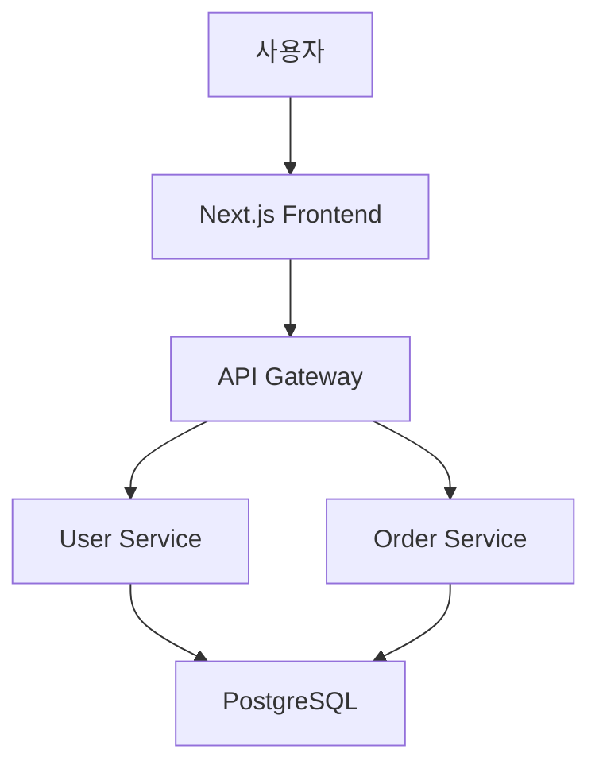

# 과제 제출 템플릿

## 📝 주간 과제 제출 형식

각 주차별 과제를 제출할 때 다음 형식을 따라주세요.

---

## Week 1 과제 제출

### ✅ 완료한 과제
1. [ ] Semantic HTML 포트폴리오 사이트 작성
2. [ ] CSS Box Model 적용
3. [ ] GitHub repository 생성 및 커밋

### 📂 산출물
- **GitHub Repository URL**: https://github.com/yourusername/my-portfolio-2026
- **라이브 데모 URL** (배포 시): https://yourusername.github.io/my-portfolio-2026/
- **스크린샷**: (브라우저에서 보이는 모습)

### 📊自我 평가
- **학습 시간**: 총 ____ 시간
- **어려웠던 점**:
  1.
  2.
- **잘된 점**:
  1.
  2.
- **다음 주 목표**:
  1.
  2.

### ❓ 질문
1.
2.

---

## 📋 일반 과제 제출 템플릿

### Week [번호] 과제 제출

#### 과제 개요
- **주제**: [과제 제목]
- **요구사항**: [주요 요구사항 3-5개]

#### 완료情况
- [ ] 요구사항 1
- [ ] 요구사항 2
- [ ] 요구사항 3

#### 코드/프로젝트
- **Repository**: [URL]
- **Branch**: [브랜치명]
- **커밋 해시**: [최신 커밋 해시]

#### 실행 방법
```bash
# 설치
npm install

# 실행
npm start

# 테스트
npm test
```

#### 데모/스크린샷
[이미지나 데모 링크]

#### 배운 점
1.
2.

#### 어려웠던 점 & 해결 방법
1. 문제: [설명]
   해결: [방법]

#### 다음 과제 목표
1.
2.

---

## 🎯 프로젝트 제출 템플릿 (월간 프로젝트)

### Month [번호] 프로젝트: [프로젝트명]

#### 프로젝트 개요
- **목표**: [프로젝트가 무엇인가]
- **기간**: [시작일] ~ [종료일]
- **기술 스택**:
  - Frontend: [기술들]
  - Backend: [기술들]
  - Database: [기술들]
  - DevOps: [기술들]

#### 기능 목록
- [ ] 기능 1
- [ ] 기능 2
- [ ] 기능 3
- [ ] 기능 4

#### 아키텍처 다이어그램
```mermaid
[여기에 다이어그램]
```

#### 설치 및 실행
```bash
git clone [repo-url]
cd [project-folder]
npm install
npm run dev
```

#### API 명세서 (해당 시)
```
POST   /api/endpoint   - 설명
GET    /api/endpoint   - 설명
PUT    /api/endpoint   - 설명
DELETE /api/endpoint   - 설명
```

#### 테스트
- 단위 테스트: ____ 개
- 커버리지: ____%
- 통합 테스트: ____ 개
- E2E 테스트: ____ 개

#### 배포
- **Vercel/Railway/AWS URL**: [링크]
- **도메인**: [있으면]

#### 코드 품질
- ESLint: 통과 / 실패
- Prettier: 적용 / 미적용
- 커밋 컨벤션: 준수 / 비준수

#### 배운 점 (상세)
1. **[기술명]**:
   - 예상: [예상했던 것]
   - 실제: [실제로 배운 것]
   - 적용: [다음에 어떻게 쓸까]

2. **[기술명]**:
   - 문제: [마주한 문제]
   - 해결: [해결 과정]
   - 인사이트: [깨달음]

#### 어려웠던 점
1. **문제**: [자세히]
   **시도한 방법**: [1, 2, 3]
   **최종 해결**: [어떻게 해결했나]
   **소요 시간**: [시간]

2. **문제**: [자세히]
   **아직 못한 것**: [남은 과제]

#### 개선사항 (다음 버전)
- [ ] 개선 1
- [ ] 개선 2
- [ ] 개선 3

#### 피드백 요청
1. 코드 리뷰: [특정 파일/기능]
2. 아키텍처: [이렇게 해도 될까?]
3. Best Practice: [더 좋은 방법이 있나?]

---

## 📚 학습 일지 템플릿 (일일/주간)

### [날짜] 학습 일지

#### 오늘 한 일
- [ ] 학습 목표 1
- [ ] 학습 목표 2
- [ ] 프로젝트 진도

#### 시간 분배
- 코딩: ____ 시간
- 문서 학습: ____ 시간
- 문제 해결: ____ 시간
- 총: ____ 시간

#### 코드 스니펫 (배운 것)
```javascript
// 오늘 배운 코드
```

#### 질문 목록
1.
2.

#### 내일 할 일
- [ ]
- [ ]

---

### 주간 회고 (Week [번호])

#### 이번 주 완료
- [x] 과제 1
- [x] 과제 2
- [x] 프로젝트 진도

#### 시간 투자
- 총: ____ 시간
- 일평균: ____ 시간

#### 성과
1.
2.

#### 어려웠던 점
1.
2.

#### 개선할 점 (다음 주)
1.
2.

#### 다음 주 목표
- [ ]
- [ ]

---

## 🏆 포트폴리오 항목 템플릿

### [프로젝트명] 포트폴리오 항목

#### 프로젝트 소개
한 줄 설명: [50자 이내]

#### 문제 정의
현재 시장에서의 문제점이나, 이 프로젝트가 해결하려는 목표를 설명.

#### 해결책
어떻게 문제를 해결했는지 간략히 설명.

#### 기술 스택
```
Frontend: React 18, TypeScript, Tailwind CSS
Backend: Node.js, Express, Prisma
Database: PostgreSQL
DevOps: Docker, GitHub Actions, Vercel
```

#### 주요 기능
1. **기능 1**: 설명
2. **기능 2**: 설명
3. **기능 3**: 설명

#### 아키텍처/시스템 설계


#### 깨달은 점 / 트러블슈팅
1. **문제**: [상황]
   **원인**: [분석]
   **해결**: [조치]
   **결과**: [개선사항]

2. **문제**: [상황]
   **원인**: [분석]
   **해결**: [조치]
   **결과**: [개선사항]

#### 데모/시연
- **라이브 URL**: https://example.com
- **동영상**: [YouTube 링크]
- **스크린샷**:
  
  

#### GitHub
https://github.com/yourusername/repo-name

#### 참고 링크
- 관련 아티클: [링크]
- 참고한 라이브러리: [링크]
- 기술 블로그 글: [링크]

---

## 📈 진도 추적 시트 (Google Sheets)

| 주차 | 날짜 | 학습 내용 | 시간 | 완료도 | 점수(1-10) | 질문 | 비고 |
|------|------|-----------|------|--------|-------------|------|------|
| 1 | 3/18-24 | Semantic HTML, Box Model | 22h | 100% | 8 | margin collapsing | OK |
| 2 | 3/25-31 | Flexbox, Grid | - | - | - | - | 진행 중 |
| ... | ... | ... | ... | ... | ... | ... | ... |

**평가 기준**:
- 점수 8-10: 완벽, 다음 주 진도 가능
- 점수 6-7: 보통, 약간 복습 필요
- 점수 5 이하: 재도전 고려

---

## 💡 커밋 메시지 컨벤션

 Conventional Commits 형식 사용:

```
feat: 새로운 기능 추가
fix: 버그 수정
docs: 문서 수정
style: 코드 포맷팅, 세미콜론 등
refactor: 코드 리팩토링
test: 테스트 추가/수정
chore: 빌드 업무 수정, 패키지 매니저 수정
```

**예시**:
- `feat: add semantic header and navigation`
- `fix: resolve box-sizing issue in card component`
- `docs: update README with project description`
- `chore: add .gitignore and npm init`

---

**템플릿을 복사해서 각 과제마다 사용하시면 진도 관리가 용이합니다!**
